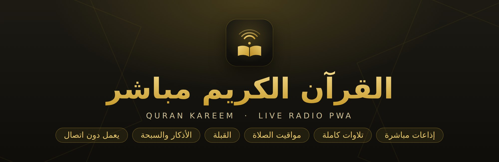
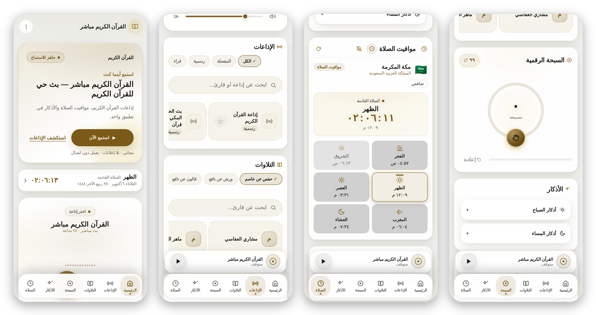
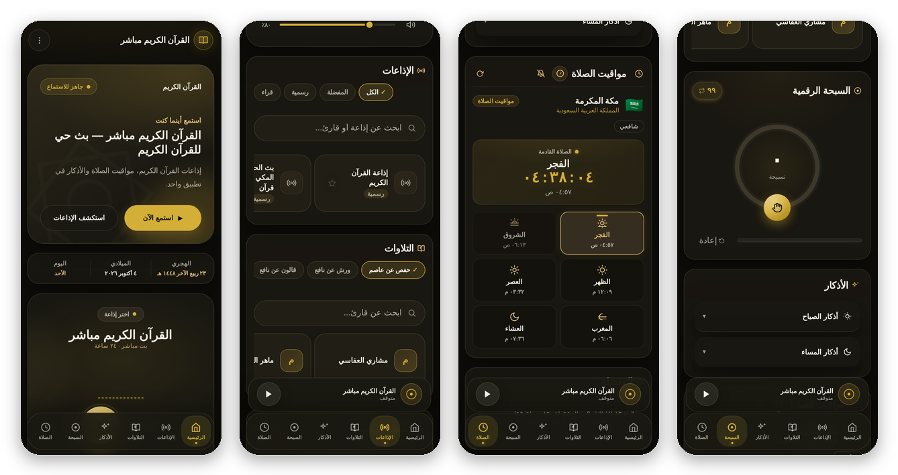

<div align="center">



<br/>

[](https://qurankareem.live)
[](https://qurankareem.live)
[](CHANGELOG.md)


**[🌐 Live site](https://qurankareem.live) · [✨ Features](#-features) · [🚀 Run locally](#-run-locally) · [🧱 Architecture](#-architecture) · [📨 Contact](#-author--contact)**

<sub>النسخة العربية: [README.md](README.md)</sub>

</div>

---

## 📖 About

**Quran Kareem Live** (القرآن الكريم مباشر) is a calm, fast, Arabic-first Progressive Web App that brings together **live Quran radio**, **full-surah recitations** by dozens of reciters and narrations, **prayer times**, **Qibla direction**, **azkar** and a **digital tasbih** in one place.

It is mobile-first (one-hand use), installable on the home screen, and works offline after the first visit.

> It is **not** a Mushaf text reader or verse-search app — it is a listening and daily-worship app.

## 📱 Screenshots

<div align="center">

**Light**



**Dark**



<sub>Left to right in the Arabic UI (RTL): Home · Radio & recitations · Prayer times · Tasbih & azkar</sub>

</div>

## ✨ Features

### 🎧 Listening
| Feature | Details |
|---|---|
| **Live radio** | The "Listen now" button plays **the last station you listened to** (or the default). 19 streams: 6 official stations (Quran Radio, Makkah & Madinah Haram, Sharjah, Tafsir, Ruqyah) and 13 reciters; search and filters (All / Favorites / Official / Reciters) |
| **Full recitations** | Pick the narration (Hafs, Warsh, Qalon…), the reciter, then the surah; previous/next and state restore. Data from the [mp3quran.net](https://mp3quran.net) API |
| **Offline recitations** | Save chosen surahs in the browser cache and play them without internet |
| **Mini player** | Controls whichever source is active (radio or recitation) with Media Session lock-screen integration |
| **Focus mode** | A full-screen, distraction-free player |

### 🕌 Worship
| Feature | Details |
|---|---|
| **Prayer times** | A "next prayer" card with a live countdown on the first screen. Calculated locally with Adhan; method chosen per country (Umm al-Qura, Egyptian, Dubai, Kuwait, Qatar…), Asr madhab (Shafi/Hanafi), next-prayer countdown, optional sound alert |
| **Qibla** | Compass using device sensors with direction, distance to the Kaaba and alignment states; lazy-loaded on first open |
| **Azkar** | Morning and evening azkar with counters and daily saved progress |
| **Digital tasbih** | Counter with an adjustable goal, milestones and a goal-reached message |
| **Favorites** | Save favourite stations |

### 🎨 Experience
- Calm **warm-gold** identity; **light / dark / system** themes
- Native Arabic RTL, **Cairo** and **Amiri** fonts
- **Arabic-Indic digits** (٠–٩) everywhere; six-item bottom navigation; a tablet layout (768–1023px: grids and wider content) and a desktop layout (sidebar from 1024px) with shortcuts: `Space` play/pause · `M` mute · `[` `]` previous/next
- Honors `prefers-reduced-motion`; status indicators are static (no blinking)

### 📲 PWA
- Home-screen install: a quiet banner **based on intent** — shown 20 s after you start listening or on the second visit, respects dismissal for 14 days, with manual instructions where automatic install isn't available
- Separate `any` and `maskable` icons + iOS icon + favicons
- **Offline:** page and assets are served from cache, with an Arabic fallback page
- **Safe updates:** a new version shows an "Update now" toast and **never reloads automatically**, so audio isn't interrupted

## 🧰 Tech stack

| Layer | Used |
|---|---|
| Language | HTML + CSS + **vanilla JavaScript** (no React/Vue, no build step) |
| Streaming | [hls.js](https://github.com/video-dev/hls.js) 1.5.15 (local in `vendor/`, loaded on demand) |
| Prayer times | [Adhan JS](https://github.com/batoulapps/adhan-js) (local) |
| Recitations | [mp3quran.net API v3](https://mp3quran.net) |
| Location | local cache → IP providers (ipwho.is / ip-api / ipapi.co) → GPS **only on an explicit tap** → Makkah fallback; city name via OpenStreetMap Nominatim |
| Fonts | Cairo · Amiri (Google Fonts) |
| Hosting | GitHub Pages + custom domain (`CNAME`) |

## 🧱 Architecture

```text
.
├── index.html              page, SEO, structured data, SW registration
├── sw.js                   Service Worker (networkFirst, page/asset caches, saved recitations)
├── manifest.json           PWA identity and shortcuts
├── offline.html            offline fallback page
├── css/styles.min.css      design system (semantic tokens, light/dark)
├── js/
│   ├── app.js              orchestrator: radio, favorites, tasbih, azkar, navigation
│   ├── ui.js               prayer times UI
│   ├── prayerService.js    prayer calculation + cache
│   ├── qiblaUI.js          Qibla UI (lazy-loaded)
│   ├── qiblaService.js     Qibla math + cache
│   ├── recitationUI.js     recitations UI
│   ├── recitationService.js  mp3quran API client
│   ├── locationService.js  location detection chain
│   ├── pwa-install.js      install experience
│   └── ui-enhancements.js  small UI helpers
├── vendor/                 hls.js, adhan (local)
├── audio/takbeer.mp3       alert sound
├── tests/                  unit + e2e + run_all.sh
└── docs/                   README images
```

More: [`TECHNICAL_AUDIT.md`](TECHNICAL_AUDIT.md) · [`UI_UX_AUDIT.md`](UI_UX_AUDIT.md) · [`DESIGN_SYSTEM.md`](DESIGN_SYSTEM.md)

## 🎨 Color system

| Role | Light | Dark |
|---|---|---|
| Primary (interactive) |  `#7A5A16` |  `#D4AF37` |
| Background |  `#F0F1EE` |  `#0E0D0A` |
| Text |  `#1B1A16` |  `#F4F0E6` |

A single interactive color; red is reserved for errors.

## 🔒 Privacy & security

- **No accounts, no tracking, no ads, no analytics.** All data (favorites, counter, settings…) stays in your browser.
- **Location:** approximated automatically from IP; **GPS is requested only when you tap**. To show the city name in Arabic, the approximate coordinates (derived from IP) are sent once to OpenStreetMap Nominatim and the result is cached. Clear everything via *Settings → Reset app data*.
- External connections: radio streams, mp3quran.net, location providers, Nominatim, Google Fonts.
- Local storage is validated before use (types/ranges) and API text is escaped before rendering; no `eval` / `document.write`.
- The app uses no encryption (and needs none: no secrets, no accounts).

## ♿ Accessibility

Semantic HTML, `lang="ar" dir="rtl"`, skip link, station/reciter/surah cards are real buttons, dialogs with full focus management (enter / trap / restore), `aria-live` regions for playback status, visible focus rings for every keyboard stop, and contrast checked against WCAG AA in both themes.

## 🚀 Run locally

No build step. Any static server works (the Service Worker needs `localhost` or HTTPS):

```bash
git clone https://github.com/k5alooood/Quran.git
cd Quran
python3 -m http.server 8000      # or: npx serve .
# open http://localhost:8000
```

## 🧪 Tests

```bash
pip install playwright pillow && playwright install chromium
bash tests/run_all.sh            # syntax + unit + e2e + accessibility scan
SLOW=1 bash tests/run_all.sh     # + install-banner test (~40 s)
```

| Type | Content |
|---|---|
| Unit (Node) | Qibla math (25) · cache validation (20, mocked) · prayer countdown (5) · Arabic city name (6) |
| e2e (Chromium) | full regression (55) · 5.4.0 changes: dialogs/cards/numerals/tablet (67) · corrupt/poisoned storage (17) · SW update flow (7) · install banner (5) · accessibility & contrast scans |

Full results and what is **not** yet verified (real audio, Android/iOS devices, Lighthouse, Firefox/Safari): [`QA_FINAL_REPORT.md`](QA_FINAL_REPORT.md).

## 🌍 Deployment

Served by **GitHub Pages** from `main`; the domain comes from the `CNAME` file (it must contain only `qurankareem.live`). When changing any CSS/JS/HTML:

1. Bump the cache names in `sw.js` (`CACHE_S` and `CACHE_P`) so updates reach users.
2. Update `VERSION`, the footer in `index.html`, and `CHANGELOG.md`.
3. Run `bash tests/run_all.sh` before pushing.

## ⚠️ Notes

- Prayer times are computed automatically; please cross-check with your local authority when needed.
- Audio (streams and recitations) belongs to its owners and the sources listed; this app is only a player.
- Not yet tested on real devices: installation, background/lock-screen audio, sensor-based compass, and iOS Safari.

## 🙏 Credits

[mp3quran.net](https://mp3quran.net) · [Adhan JS](https://github.com/batoulapps/adhan-js) · [hls.js](https://github.com/video-dev/hls.js) · [OpenStreetMap Nominatim](https://nominatim.org) · [Google Fonts](https://fonts.google.com) · and every broadcaster who makes these streams available.

## 📨 Author & contact

<div align="center">

**Khaled Sameh** — developer and designer of **Quran Kareem Live**

[](https://www.linkedin.com/in/k5aloood)
[](https://qurankareem.live)
[](https://github.com/k5alooood)

Feature ideas or bug reports: [open an issue](https://github.com/k5alooood/Quran/issues) or message me on LinkedIn.

<sub>Built with ❤️ in service of the Book of Allah.</sub>

</div>
